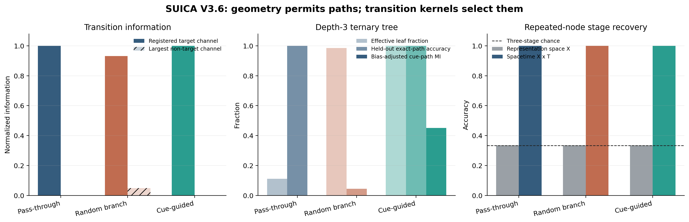

# V8 Spacetime Junction-Flow V3.6

## Decision

`V8_SPACETIME_JUNCTION_FLOW_V36_PASS`

Independent audit decision:
`REGISTERED_DGP_TECHNICAL_PASS / TREE_CAPACITY_PARTIAL`.

All 15 frozen technical gates passed. The result establishes a routing
decomposition in registered planted spacetime worlds. It does not establish
that a junction in real text is a thought node, a personality signal, or an
intelligence mechanism.

## Frozen object

The same representation-space node recurs at three ordered stages. V3.6
lifts it into the product space

\[
d_\lambda((x,t),(y,s))^2=d_X(x,y)^2+\lambda^2(t-s)^2
\]

and estimates, at each junction, incoming branch \(B^-\), outgoing branch
\(B^+\), cue \(C\), group \(G\), and stage \(J\):

\[
G_C=\frac{I(B^+;C\mid B^-,G,J)}{\log K},
\qquad
G_T=\frac{I(B^+;B^-\mid C,G,J)}{\log K},
\]

\[
H_{\mathrm{res}}
=\frac{H(B^+\mid B^-,C,G,J)}{\log K}.
\]

Here \(G_C\) is cue-conditioned routing, \(G_T\) is inertial
pass-through, and \(H_{\mathrm{res}}\) is unexplained branching. The
registered tree has three branches and depth three, hence 27 possible leaves.

## Confirmation results

There were 500 fresh confirmation populations for each primary world and 200
for each attack.

| World | \(G_C\) | \(G_T\) | \(H_{\rm res}\) | effective leaf fraction | cue-goal path | addressable leaves |
| --- | ---: | ---: | ---: | ---: | ---: | ---: |
| cue-guided | 1.000 | 0.000 | 0.000 | 1.000 | 1.000 | 27 |
| pass-through | 0.000 | 1.000 | 0.000 | 0.111 | 0.000 | 0 |
| random-branch | 0.035 | 0.036 | 0.949 | 0.985 | 0.0365 | 0 |

Each world was correctly identified 500/500 times; the one-sided 95% lower
bound was 0.9940. Junction F1, temporal-order Kendall tau, and tangent-view
ARI had minima of 1.000 in all three primary worlds.

All worlds had unconditional branch entropy near 1.0. This is the important
negative result: high apparent branching does not distinguish controlled
choice from random exploration or pass-through marginals.

Static marginal features classified the three worlds at 0.316 accuracy
(three-class chance is approximately 0.333). Event-level correspondence, not
point counts or static branch marginals, carried the routing information.

## Time and tree

Spatial coordinates alone recovered stage at only 0.333 on average and never
above 0.3355. Adding the registered time coordinate recovered stage at 1.000.
This is a construction sanity check: the generator deliberately repeats the
same spatial node and appends the true `0/1/2` stage coordinate. It proves
only that explicit time preserves an order that the spatial construction
removes; it does not discover latent temporal stages from text geometry.

The registered per-step cue-output diagnostic reached
\(\log_2 3=1.585\) bits per junction and all 27 leaves were cue-addressable.
The random world occupied almost the entire tree but had capacity only 0.0029
bits and goal-path accuracy 0.0365, approximately \(1/27\). The
pass-through world occupied only three repeated paths, an effective leaf
fraction of \(3/27=0.111\).

These are simulator diagnostics, not a general tree-capacity estimate. The
calculation pools stages and groups, then multiplies a single empirical
cue-output channel as if stages were independent. The 27/27 result is largely
entailed by the deterministic \(B^+=C\) generator and enumeration of all
\(3^3\) cue paths. The frozen plan's cue-conditioned whole-path entropy was
not emitted in the frozen run; V3.6.1 supplies it as a separately labeled
post-seal scope correction.

These results separate:

1. geometry: which continuations are available;
2. transition kernel: which continuation is selected;
3. task value: whether that selection achieves an external goal.

V3.6 measures the first two. It contains no external reward.

## Counterfactual results

| Attack | Result |
| --- | --- |
| cue shuffle | 0/200 cue-guided claims; upper 95% 0.0149 |
| time shuffle | 0/200 accepted cue-guided claims; upper 95% 0.0149 |
| tangent-view shuffle | 200/200 view-instability refusals |
| guided near miss | 200/200 no-junction refusals while raw \(G_C=1.0\) |
| pass-through cue shuffle | \(G_T\) changed only 0.0114 |

The logical consequence is narrower than the original headline:

- a common junction is **not sufficient** for cue-sensitive routing, because
  pass-through and random worlds share the same junction geometry;
- the **registered radius-0.15 cross-author common-ball criterion** is not
  necessary for cue-sensitive routing, because the guided near-miss retains
  \(G_C=1.0\) while failing that gate.

The experiment does not rule out every mathematical form of intersection.
Within the registered criterion, the common junction is an **opportunity
structure**, not the cause or content of the transition.

## Implication for the thought-node hypothesis

The experiment makes the idea mathematically testable but does not confirm
its psychological interpretation. A candidate text “thought node” would
need all of the following:

- a condition-matched, cross-radius, cross-view stable local junction;
- reproducible incoming and outgoing tangent classes;
- a transition kernel that depends on interpretable cues or history;
- author-specific routing parameters stable under new contexts;
- external task success, cost, and novel-cue generalization.

Only the first three are identified here, and only in simulation. Until the
last two are tested, the supported name is **spacetime routing junction**.

## Integrity

The prospective hashes match every frozen config, theory, estimator, runner,
and test file. The generated artifact inventory verifies without mismatch.
No confirmation-driven threshold change was made.

Canonical artifacts:

- `results/v8_spacetime_junction_flow/v36_final_20260726/decision.json`
- `results/v8_spacetime_junction_flow/v36_final_20260726/confirmation_primary_metrics.csv`
- `results/v8_spacetime_junction_flow/v36_final_20260726/confirmation_control_metrics.csv`
- `results/v8_spacetime_junction_flow/v36_final_20260726/run_manifest.json`
- `results/v8_spacetime_junction_flow/v36_final_20260726/artifact_inventory.json`

Post-seal scope correction:
`reports/V8_SPACETIME_JUNCTION_FLOW_V361_SCOPE_CORRECTION_REPORT.md`.
